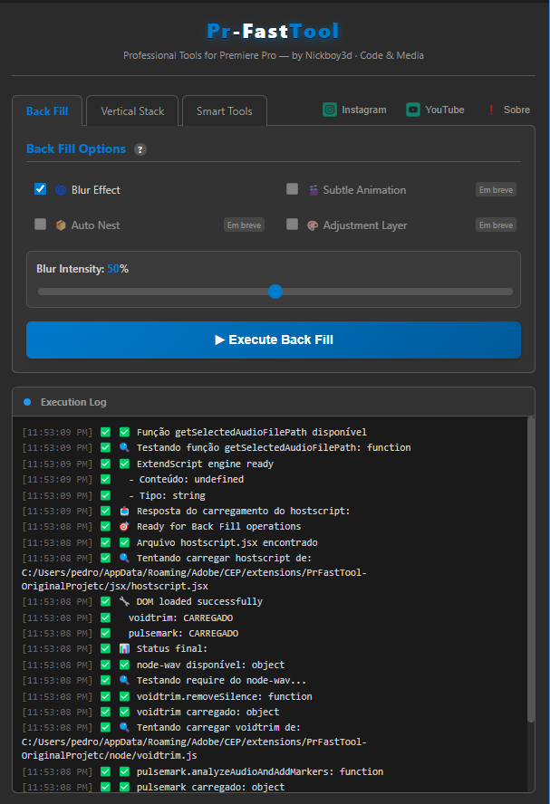
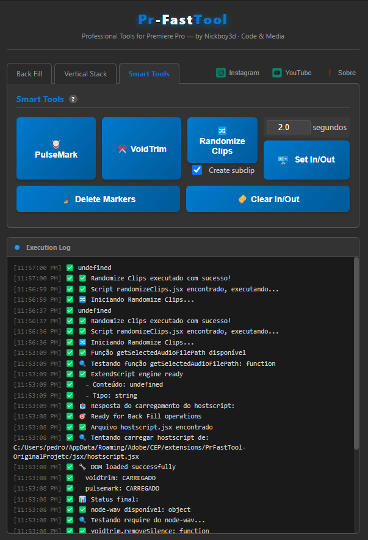
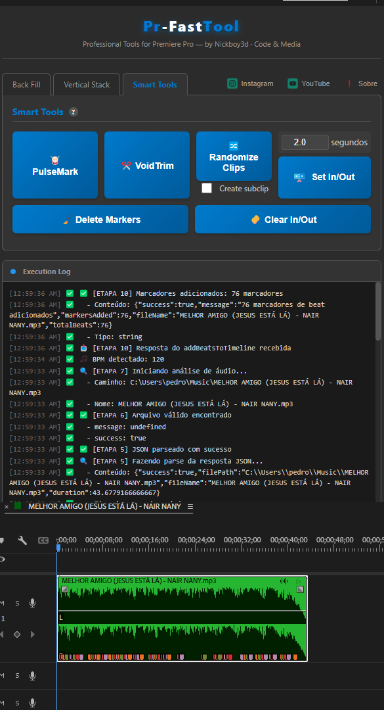

# 🎬 PrFastTool - Automação para Adobe Premiere Pro

> Extensão CEP que automatiza tarefas repetitivas no Adobe Premiere Pro, economizando horas de trabalho manual em edição de vídeo.


---

## ✨ Funcionalidades Principais

### 🔇 Detecção e Remoção de Silêncio
- **Análise automática de áudio** usando FFmpeg
- **Detecção inteligente** de segmentos silenciosos
- **Remoção automatizada** com marcadores visuais
- **Threshold configurável** (dB e duração)

### ✂️ Subclipping Automatizado
- **Criação rápida** de subclips a partir de IN/OUT points
- **Nomenclatura automática** ou personalizada
- **Organização inteligente** no painel de projeto

### 🎲 Randomização de Clipes
- **Embaralha sequências** automaticamente
- **Preserva estrutura** de áudio/vídeo
- **Útil para B-rolls** e montagens criativas

### 🎯 Marcadores Inteligentes
- **Pulsemark**: Cria marcadores em pontos de pico de áudio
- **Gestão de IN/OUT**: Define pontos de edição automaticamente
- **Limpeza de marcadores**: Remove marcadores em massa

### 🔊 Exportação de Áudio
- **Extração de faixas** de áudio da timeline
- **Conversão automática** para múltiplos formatos
- **Processamento em lote**

---

## 📦 Requisitos

### Software Necessário
- **Adobe Premiere Pro** 23.0 ou superior
- **Node.js** 18+ (para processamento de áudio)
- **FFmpeg** (incluído ou instalado separadamente)
- **Windows 10/11** ou **macOS 10.15+**

### Dependências Node.js
```json
{
  "fluent-ffmpeg": "^2.1.2",
  "wavefile": "^11.0.0"
}
```

---

## 🚀 Instalação

### 1. Habilitar Debug Mode do CEP

**Windows:**
```powershell
# Execute como Administrador
reg add HKCU\Software\Adobe\CSXS.11 /v PlayerDebugMode /t REG_DWORD /d 1 /f

# Ou execute o arquivo .bat incluído:
enable_debug.bat
```

**macOS:**
```bash
defaults write com.adobe.CSXS.11 PlayerDebugMode 1
```

### 2. Instalar a Extensão

**Windows:**
```powershell
# Copie a pasta da extensão para:
C:\Users\%USERNAME%\AppData\Roaming\Adobe\CEP\extensions\PrFastTool
```

**macOS:**
```bash
# Copie para:
~/Library/Application Support/Adobe/CEP/extensions/PrFastTool
```

### 3. Instalar Dependências

```bash
cd PrFastTool
npm install
```

### 4. Reinicie o Premiere Pro

A extensão aparecerá em: **Window → Extensions → PrFastTool**

---

## 📖 Como Usar

### Remover Silêncio Automaticamente

1. Selecione um clipe de áudio na timeline
2. Abra a extensão **PrFastTool**
3. Clique em **"Detect Silence"**
4. Ajuste o threshold (padrão: -40dB, 0.5s)
5. Clique em **"Remove Segments"**

### Criar Subclips em Lote

1. Selecione um clipe no painel de projeto
2. Defina múltiplos IN/OUT points
3. Clique em **"Create Subclips"**
4. Os subclips serão criados automaticamente

### Randomizar Sequência

1. Selecione os clipes na timeline
2. Clique em **"Randomize Clips"**
3. A ordem será embaralhada preservando duração

---

## 🛠️ Estrutura do Projeto

```
PrFastTool/
├── CSXS/
│   └── manifest.xml          # Configuração da extensão CEP
├── html/
│   └── index.html            # Interface do painel
├── js/
│   ├── main.js               # Lógica principal da UI
│   └── cep-fix.js            # Correções de compatibilidade
├── jsx/
│   ├── hostscript.jsx        # Ponte ExtendScript principal
│   ├── removeSilenceSegments.jsx
│   ├── subclip.jsx
│   ├── randomizeClips.jsx
│   └── audio_exports/
├── node/
│   ├── audioConverter.js     # Conversão de áudio
│   ├── voidtrim.js          # Detecção de silêncio
│   └── pulsemark.js         # Detecção de picos
├── libs/
│   └── CSInterface.js        # Biblioteca Adobe CEP
└── assets/                   # Recursos visuais
```

---

## 📸 Screenshots


*Interface principal do PrFastTool*


*Nova funcionalidade: Smart Tools*


*Marcador de batidas da música*

---

## 🔧 Configuração Avançada

### Ajustar Detecção de Silêncio

Edite `node/voidtrim.js`:

```javascript
const SILENCE_THRESHOLD = -40; // dB (mais negativo = mais sensível)
const MIN_SILENCE_DURATION = 0.5; // segundos
const BUFFER_TIME = 0.1; // margem antes/depois do corte
```

### Personalizar Interface

Edite `html/index.html` e `js/main.js` para customizar cores, layout e funcionalidades.

---

## 🐛 Troubleshooting

### Extensão não aparece no Premiere

1. ✅ Verifique se o `PlayerDebugMode` está ativado
2. ✅ Confirme que a pasta está em `CEP/extensions/`
3. ✅ Reinicie o Premiere completamente
4. ✅ Verifique o `CSXS/manifest.xml` para versão correta

### Erro "Cannot find module"

```bash
cd PrFastTool
npm install --save fluent-ffmpeg wavefile
```

### FFmpeg não encontrado

**Windows:** Baixe de [ffmpeg.org](https://ffmpeg.org/download.html) e adicione ao PATH

**macOS:**
```bash
brew install ffmpeg
```

---

## 🤝 Contribuindo

Contribuições são muito bem-vindas!

1. **Fork** o repositório
2. Crie uma **branch** (`git checkout -b feature/NovaFuncionalidade`)
3. **Commit** suas mudanças (`git commit -m 'Adiciona nova funcionalidade'`)
4. **Push** para a branch (`git push origin feature/NovaFuncionalidade`)
5. Abra um **Pull Request**

---

## 📝 Roadmap

- [x] Detecção de silêncio com FFmpeg
- [x] Criação automatizada de subclips
- [x] Randomização de sequências
- [x] Exportação de áudio
- [ ] **Análise de áudio com IA**
- [ ] **Auto-sync de múltiplas câmeras**
- [ ] **Geração de proxies inteligentes**
- [ ] **Suporte a UXP**

---

## 📄 Licença

Este projeto está licenciado sob a **MIT License**.

---

## 👨‍💻 Autor

**NickBoy - Code&Media**

- GitHub: [@NickBoyCodeMedia](https://github.com/NickBoyCodeMedia)

---

## 🙏 Agradecimentos

- **Adobe** - Pela plataforma CEP/ExtendScript
- **FFmpeg Team** - Pela biblioteca de processamento
- **Comunidade CEP** - Pelos recursos e documentação

---

<div align="center">

**Se este projeto ajudou você, considere dar uma ⭐️!**

[Reportar Bug](https://github.com/NickBoyCodeMedia/PrFastTool-Automacao-para-Adobe-Premiere-Pro-public-demo/issues) · [Solicitar Feature](https://github.com/NickBoyCodeMedia/PrFastTool-Automacao-para-Adobe-Premiere-Pro-public-demo/issues)

</div>
